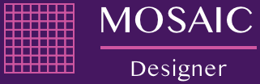
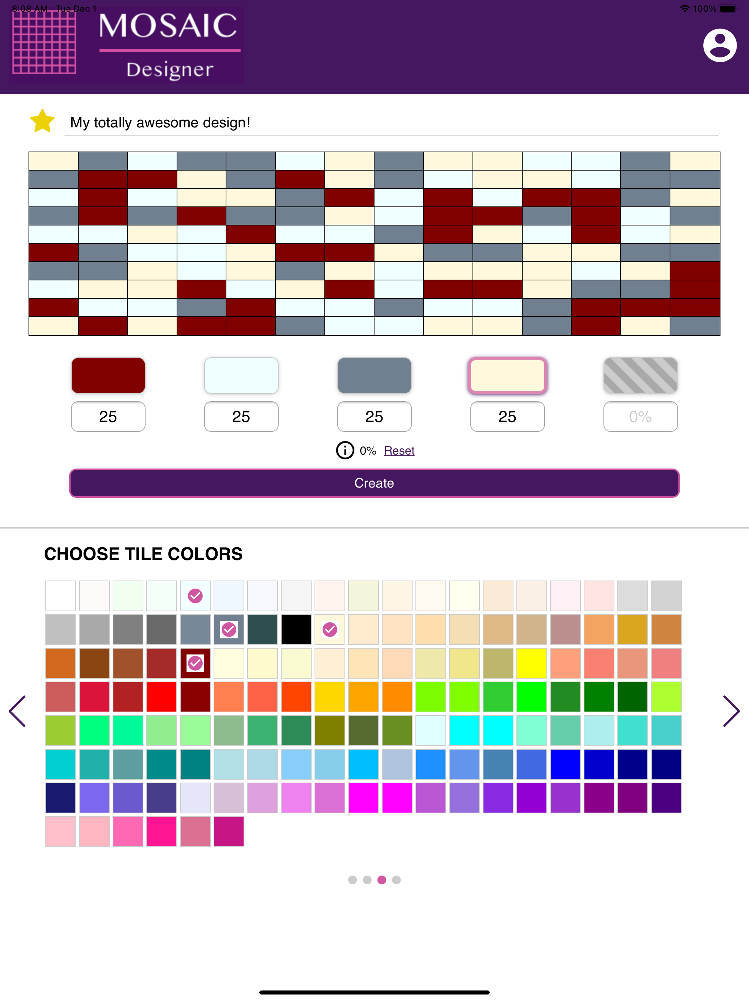

## Overview

The Mosaic Designer mobile app is a design tool for creating custom mosaic tile patterns. An example would be a decorative backsplash for a kitchen or bathroom. Typical users of this application would include customers, architects, showroom consultants, and outside sales representatives.

The application allows users to experiment with different mosaic patterns while customizing the pattern and colors of the mosaic. For example, a user might design a mosaic tile backsplash with a 1x1 straight pattern containing an equal (25/25/25/25) mix of blue, green, red and yellow tiles with a black grout color. Users can create profiles by registering and then save their favorite designs for access on multiple devices.

## Wireframe

[Wireframe](docs/wireframe.pdf)

## Mockup

[Mockup](docs/mockup.pdf)

## User Flow

[User Flow](docs/user-flow.pdf)

## Technologies

- Cordova (framework)
- npm (package manager)
- Webpack (module bundler)
- Vue.js (JavaScript framework)
- Plug-ins / libraries:
    - Swiper (touch slider)
    - ESLint (JavaScript linter)
    - Mocha & Chai (unit testing)
- Design:
    - Lucidchart (wireframe)
    - Sketch (mockup)